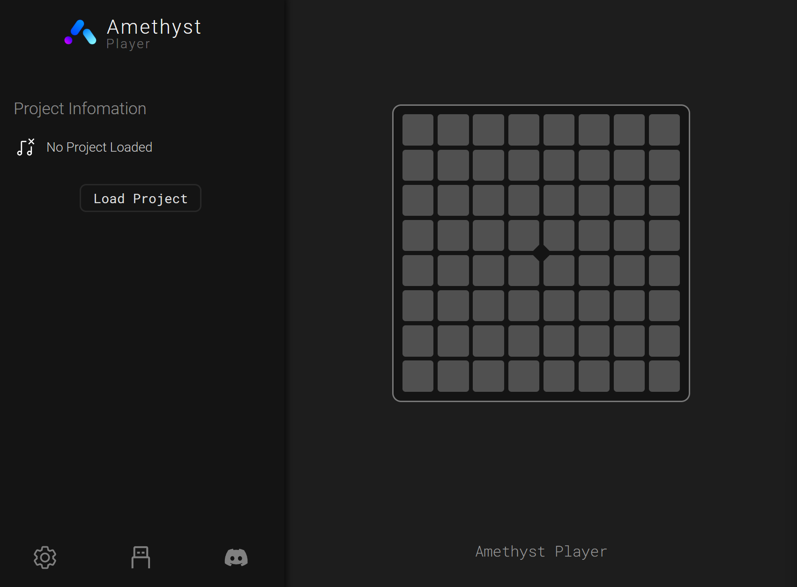
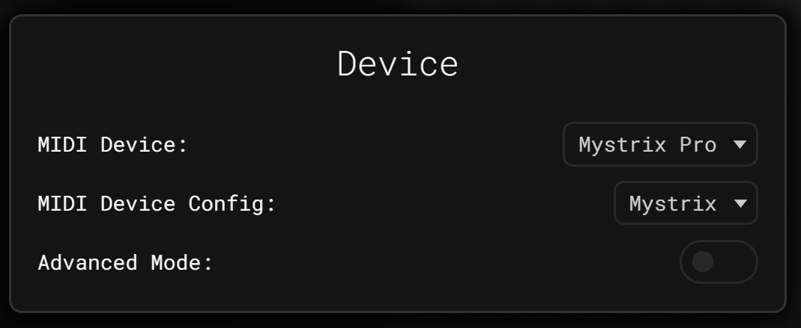
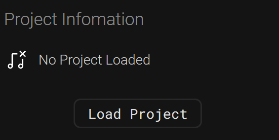
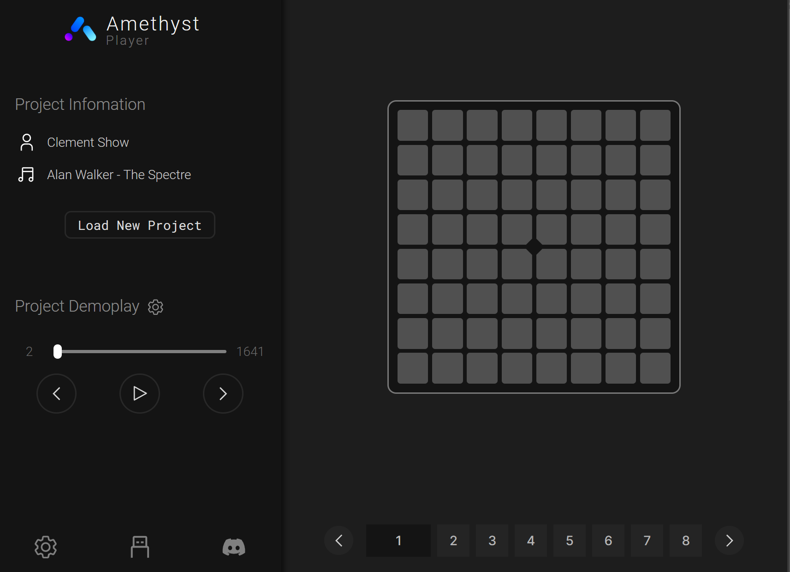
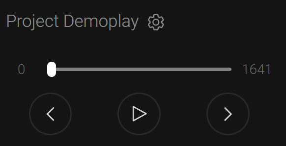
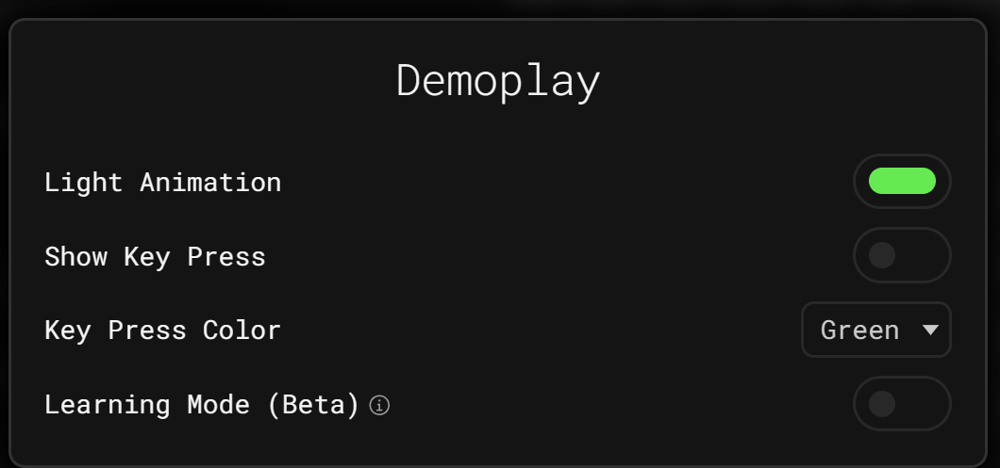
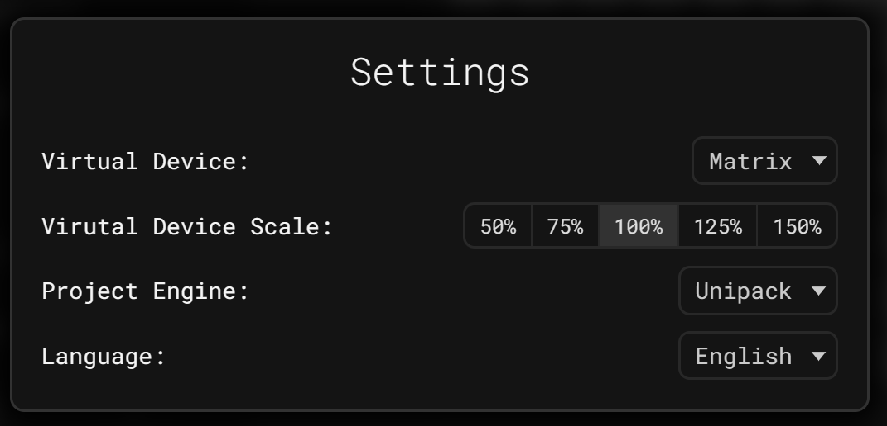

# Amethyst Player

Amethyst Player is 203 System's in-house web application for performing lightshows.

It is available on [play.203.io](https://play.203.io) as a web app or PWA (Progressive Web App).

Currently, it supports playing Unipad Projects (Unipack) online. You can connect Mystrix or other compatible MIDI controllers with a [web MIDI-enabled browser](https://developer.mozilla.org/en-US/docs/Web/API/MIDIAccess#Browser_compatibility) to start playing.

## How to Use

1. Open the website.
2. Connect your Mystrix and enter the [Performance App](/docs/MatrixOS/Applications/Performance).
3. Check and configure the device via the USB icon at the bottom of the screen or the bottom of the sidebar.

 4. Click the `Load Project` button and select the zip file.

5. If everything is correct, your project should now be ready to play.

## Demo Play

If your project supports demo play, the `Project Demoplay` widget should appear in the UI. You can adjust the play time, next step, previous step, play, and pause.

Additionally, you can click the gear icon to the right of `Project Demoplay` to modify settings.

## Settings

You can adjust settings via the gear icon in the UI.

In the settings, you can change the virtual device, the size of the virtual device, the [Project Engine](#supported-lightshow-engines), and the language.

## Hotkeys

| Key                         | Function               |
| --------------------------- | ---------------------- |
| **R**                       | Load Project           |
| **Space** / **P**           | Play & Pause Demoplay  |
| **Left** / **A**            | Demoplay move backward |
| **Right** / **D**           | Demoplay move forward  |
| **Up** / **W** / **E**      | Next Layer             |
| **Down** / **S** / **Q**    | Previous Layer         |
| **Any Number Key**          | Switch to Layer        |
| **Enter** / **F** / **ESC** | Toggle Full Screen     |
| **Z**                       | Show Player Setting    |
| **X**                       | Show Device Setting    |
| **C**                       | Show Demoplay Setting  |

## Get Unipad Projects (UniPack)

You can get Unipad Projects from YouTube videos. Here are some great examples:

- [Alan Walker - The Spectre by Clement Show](https://www.youtube.com/watch?v=-96eVsFJW-M)
- [BLACKPINK (블랙핑크) - 뚜두뚜두 (DDU-DU-DDU-DU) by JinCreeMusic](https://www.youtube.com/watch?v=QTsq8lM9uqg)
- [Porter Robinson & Madeon - Shelter by Clement Show](https://www.youtube.com/watch?v=TnPQg9h6Un0)
- [Fonglee, Moudelica & Silkorr - Midnight City by YamiEDM](https://www.youtube.com/watch?v=KYiaGXlBxLE)
- [Alan Walker - Darkside by Yubo Ki](https://www.youtube.com/watch?v=ZtSGblqfmKQ)

~~Or from sites like [Unipad DB Kims](https://unipad.dbkims.com/).~~ (Currently down)

## Supported Lightshow Engines

- **Unipack**: Amethyst Player currently supports Unipack projects.
- **Superpad Lights Engine**: This engine is currently in alpha, and obtaining Superpad Lights projects is quite tricky.

## Future Lightshow Engine

- **Universal Lightshow Project (ULP)**: In the future, we will release our own lightshow project format, dubbed Universal Lightshow Project (ULP), to unify things with better compatibility and more options.
